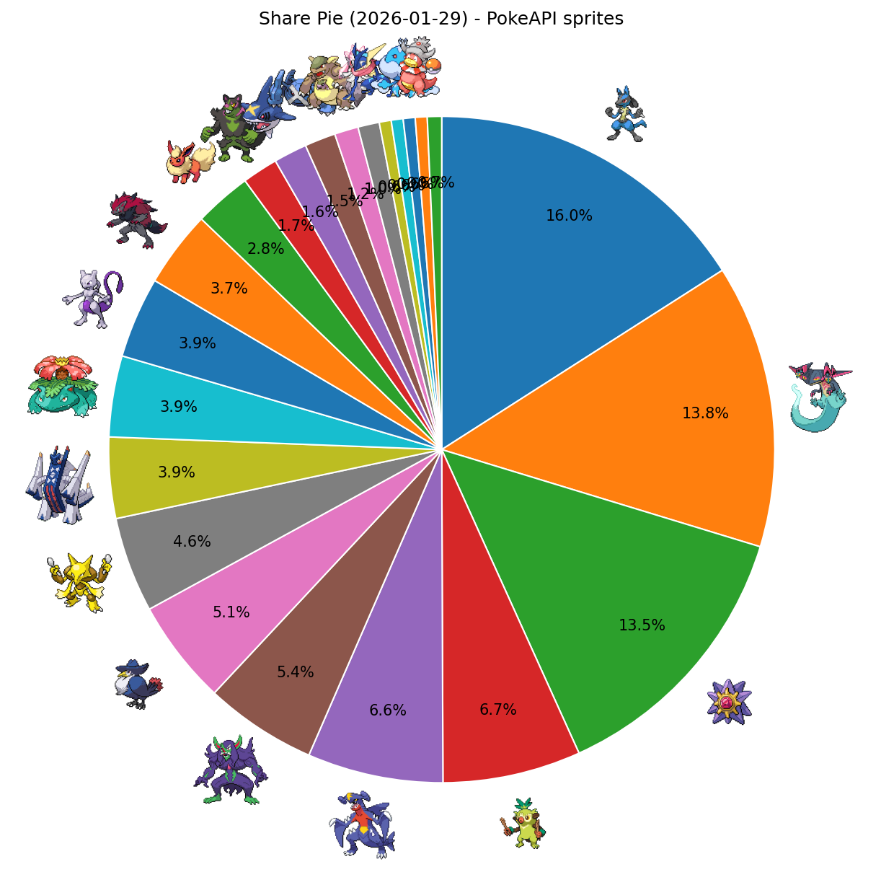

# シティリーグ週次レポート（2026-01-29更新）

## 1. 集計対象期間
- 今週分析期間（週次固定）: **2026-01-23 - 2026-01-29**
- 前週比較期間（週次固定）: **2026-01-16 - 2026-01-22**
- 今週入賞枠数: **865** / 前週入賞枠数: **0**
- ランキング表示条件: **デッキ数 5件以上**

## 2. 入賞シェア（デッキ数5件以上）
- 参照: `output_csv/2026-01-29/season3_fixed_2026-01-29_period_distribution.csv`

|順位|デッキタイプ|入賞数|シェア|
|---:|---|---:|---:|
|1|【メガルカリオex】|138|15.95%|
|2|【ドラパルトex】|119|13.76%|
|3|【メガスターミーex】|117|13.53%|
|4|【おまつりおんど】|58|6.71%|
|5|【シロナのガブリアスex】|57|6.59%|
|6|【マリィのオーロンゲex】|47|5.43%|
|7|【ロケット団のドンカラス】|44|5.09%|
|8|【フーディン】|40|4.62%|
|9|【ブリジュラスex】|34|3.93%|
|10|【メガフシギバナex】|34|3.93%|
|11|【ロケット団のミュウツーex】|34|3.93%|
|12|【Nのゾロアークex】|32|3.70%|
|13|【ブースターex】|24|2.77%|
|14|【イイネイヌ】|15|1.73%|
|15|【メガサメハダーex】|14|1.62%|
|16|【ダイゴのメタグロスex】|13|1.50%|
|17|【メガガルーラex】|10|1.16%|
|18|【メガディアンシーex】|9|1.04%|
|19|【ゲッコウガex】|5|0.58%|
|20|【テラスタルバレット】|5|0.58%|
|21|【ブルンゲルex】|5|0.58%|
|22|【ヤドキング】|5|0.58%|

## 2.1 入賞シェア円グラフ（PokeAPI sprites）
- 画像: `output_csv/2026-01-29/season3_share_pie_pokeapi_2026-01-29.png`
- 対応表: `output_csv/2026-01-29/season3_share_pie_pokeapi_2026-01-29.csv`

## 2.2 入賞シェア率の推移
- 画像: `output_csv/2026-01-29/season3_share_trend_2026-01-29.png`
- 対応表: `output_csv/2026-01-29/season3_share_trend_2026-01-29.csv`

## 3. 前週比較（台頭 / 減少）
- 参照: `output_csv/2026-01-29/season3_fixed_2026-01-29_period_delta.csv`

### 3.1 台頭したデッキ（シェア増）
|デッキタイプ|前週シェア|今週シェア|差分|
|---|---:|---:|---:|
|【メガルカリオex】|0.00%|15.95%|+15.95pt|
|【ドラパルトex】|0.00%|13.76%|+13.76pt|
|【メガスターミーex】|0.00%|13.53%|+13.53pt|
|【おまつりおんど】|0.00%|6.71%|+6.71pt|
|【シロナのガブリアスex】|0.00%|6.59%|+6.59pt|
|【マリィのオーロンゲex】|0.00%|5.43%|+5.43pt|
|【ロケット団のドンカラス】|0.00%|5.09%|+5.09pt|
|【フーディン】|0.00%|4.62%|+4.62pt|
|【ブリジュラスex】|0.00%|3.93%|+3.93pt|
|【メガフシギバナex】|0.00%|3.93%|+3.93pt|
|【ロケット団のミュウツーex】|0.00%|3.93%|+3.93pt|
|【Nのゾロアークex】|0.00%|3.70%|+3.70pt|
|【ブースターex】|0.00%|2.77%|+2.77pt|
|【イイネイヌ】|0.00%|1.73%|+1.73pt|
|【メガサメハダーex】|0.00%|1.62%|+1.62pt|
|【ダイゴのメタグロスex】|0.00%|1.50%|+1.50pt|
|【メガガルーラex】|0.00%|1.16%|+1.16pt|
|【メガディアンシーex】|0.00%|1.04%|+1.04pt|
|【ゲッコウガex】|0.00%|0.58%|+0.58pt|
|【テラスタルバレット】|0.00%|0.58%|+0.58pt|
|【ブルンゲルex】|0.00%|0.58%|+0.58pt|
|【ヤドキング】|0.00%|0.58%|+0.58pt|

### 3.2 減少したデッキ（シェア減）
|デッキタイプ|前週シェア|今週シェア|差分|
|---|---:|---:|---:|

## 4. 安定スコアランキング（デッキ数5件以上）
- 参照: `output_csv/2026-01-29/season3_fixed_2026-01-29_decktype_stability_summary.csv`
- 指標: `stability_adoption_norm60_mean`

|順位|デッキタイプ|安定スコア|デッキ数|early_setup比率|
|---:|---|---:|---:|---:|
|1|【メガスターミーex】|0.2610|113|0.524|
|2|【メガルカリオex】|0.2338|137|0.508|
|3|【ドラパルトex】|0.2324|118|0.478|
|4|【マリィのオーロンゲex】|0.2300|46|0.545|
|5|【メガサメハダーex】|0.2247|14|0.476|
|6|【Nのゾロアークex】|0.2197|32|0.440|
|7|【ブリジュラスex】|0.2126|34|0.460|
|8|【ゲッコウガex】|0.2048|5|0.433|
|9|【おまつりおんど】|0.2020|58|0.463|
|10|【シロナのガブリアスex】|0.2012|57|0.429|
|11|【ブルンゲルex】|0.1989|5|0.437|
|12|【イイネイヌ】|0.1903|14|0.427|
|13|【ヤドキング】|0.1902|5|0.360|
|14|【メガフシギバナex】|0.1845|34|0.517|
|15|【ブースターex】|0.1809|24|0.474|
|16|【ダイゴのメタグロスex】|0.1682|13|0.332|
|17|【メガディアンシーex】|0.1611|9|0.404|
|18|【メガガルーラex】|0.1582|10|0.422|
|19|【ロケット団のミュウツーex】|0.1535|34|0.459|
|20|【フーディン】|0.1315|40|0.379|
|21|【テラスタルバレット】|0.1306|5|0.433|
|22|【ロケット団のドンカラス】|0.1213|44|0.498|

## 5. 来週以降のおすすめデッキランキング（ハイブリッド方式）
- 参照: `output_csv/2026-01-29/season3_hybridA_ps1_final_decktype_ranking.csv`
- matchup方式: `hybrid_top16`（Top16＋Top8推定）
- 掲載条件: デッキ数 5件以上

|順位|デッキタイプ|final_score|meta_share|high_finish_rate|
|---:|---|---:|---:|---:|
|1|【メガスターミーex】|0.9299|13.53%|33.33%|
|2|【マリィのオーロンゲex】|0.7501|5.43%|34.04%|
|3|【ドラパルトex】|0.7402|13.76%|30.25%|
|4|【メガルカリオex】|0.7263|15.95%|26.09%|
|5|【メガサメハダーex】|0.6664|1.62%|21.43%|
|6|【Nのゾロアークex】|0.6484|3.70%|18.75%|
|7|【ブリジュラスex】|0.6353|3.93%|23.53%|
|8|【おまつりおんど】|0.5521|6.71%|25.86%|
|9|【シロナのガブリアスex】|0.5400|6.59%|28.07%|
|10|【ゲッコウガex】|0.5384|0.58%|20.00%|
|11|【ブルンゲルex】|0.5107|0.58%|20.00%|
|12|【イイネイヌ】|0.4890|1.73%|26.67%|
|13|【メガフシギバナex】|0.4546|3.93%|26.47%|
|14|【ヤドキング】|0.4433|0.58%|20.00%|
|15|【ブースターex】|0.4222|2.77%|20.83%|
|16|【メガディアンシーex】|0.3922|1.04%|44.44%|
|17|【ダイゴのメタグロスex】|0.3172|1.50%|7.69%|
|18|【メガガルーラex】|0.2860|1.16%|20.00%|
|19|【ロケット団のミュウツーex】|0.2268|3.93%|17.65%|
|20|【フーディン】|0.1170|4.62%|25.00%|
|21|【ロケット団のドンカラス】|0.0997|5.09%|38.64%|
|22|【テラスタルバレット】|0.0566|0.58%|0.00%|
