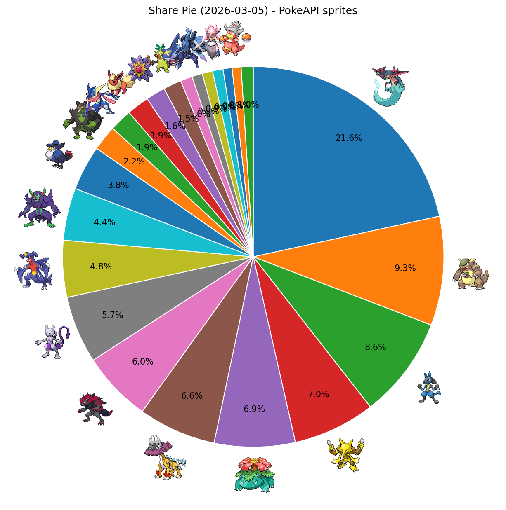
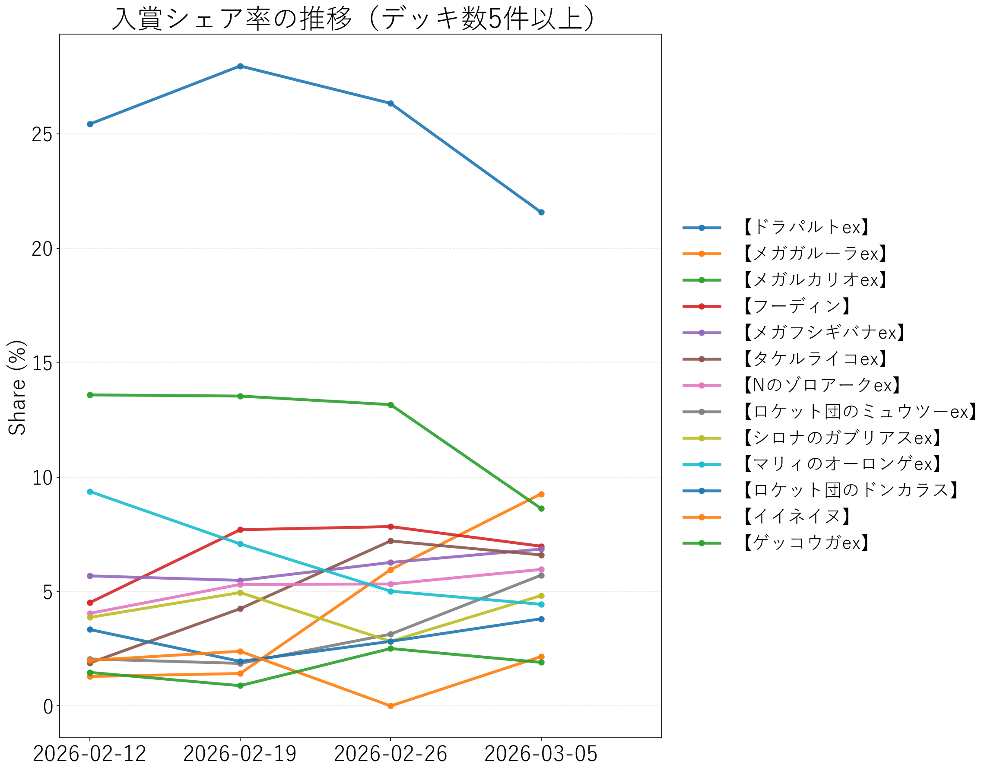

# シティリーグ週次レポート（2026-03-05更新）

## 1. 集計対象期間
- 今週分析期間（週次固定）: **2026-02-27 - 2026-03-05**
- 前週比較期間（週次固定）: **2026-02-20 - 2026-02-26**
- 今週入賞枠数: **788** / 前週入賞枠数: **0**
- ランキング表示条件: **デッキ数 5件以上**

## 2. 入賞シェア（デッキ数5件以上）
- 参照: `output_csv/2026-03-05/season3_fixed_2026-03-05_period_distribution.csv`

|順位|デッキタイプ|入賞数|シェア|
|---:|---|---:|---:|
|1|【ドラパルトex】|170|21.57%|
|2|【メガガルーラex】|73|9.26%|
|3|【メガルカリオex】|68|8.63%|
|4|【フーディン】|55|6.98%|
|5|【メガフシギバナex】|54|6.85%|
|6|【タケルライコex】|52|6.60%|
|7|【Nのゾロアークex】|47|5.96%|
|8|【ロケット団のミュウツーex】|45|5.71%|
|9|【シロナのガブリアスex】|38|4.82%|
|10|【マリィのオーロンゲex】|35|4.44%|
|11|【ロケット団のドンカラス】|30|3.81%|
|12|【イイネイヌ】|17|2.16%|
|13|【ゲッコウガex】|15|1.90%|
|14|【ブースターex】|15|1.90%|
|15|【メガスターミーex】|13|1.65%|
|16|【おまつりおんど】|12|1.52%|
|17|【メガサメハダーex】|8|1.02%|
|18|【ソウブレイズex】|7|0.89%|
|19|【ダイゴのメタグロスex】|7|0.89%|
|20|【メガディアンシーex】|7|0.89%|
|21|【テラスタルバレット】|6|0.76%|
|22|【ヤドキング】|6|0.76%|

## 2.1 入賞シェア円グラフ（PokeAPI sprites）
- 画像: `output_csv/2026-03-05/season3_share_pie_pokeapi_2026-03-05.png`
- 対応表: `output_csv/2026-03-05/season3_share_pie_pokeapi_2026-03-05.csv`

## 2.2 入賞シェア率の推移
- 画像: `output_csv/2026-03-05/season3_share_trend_2026-03-05.png`
- 対応表: `output_csv/2026-03-05/season3_share_trend_2026-03-05.csv`

## 3. 前週比較（台頭 / 減少）
- 参照: `output_csv/2026-03-05/season3_fixed_2026-03-05_period_delta.csv`

### 3.1 台頭したデッキ（シェア増）
|デッキタイプ|前週シェア|今週シェア|差分|
|---|---:|---:|---:|
|【メガガルーラex】|5.96%|9.26%|+3.31pt|
|【ロケット団のミュウツーex】|3.13%|5.71%|+2.58pt|
|【シロナのガブリアスex】|2.82%|4.82%|+2.00pt|
|【イイネイヌ】|0.31%|2.16%|+1.84pt|
|【ブースターex】|0.31%|1.90%|+1.59pt|
|【おまつりおんど】|0.31%|1.52%|+1.21pt|
|【ロケット団のドンカラス】|2.82%|3.81%|+0.99pt|
|【テラスタルバレット】|0.00%|0.76%|+0.76pt|
|【Nのゾロアークex】|5.33%|5.96%|+0.64pt|
|【メガフシギバナex】|6.27%|6.85%|+0.58pt|
|【ソウブレイズex】|0.31%|0.89%|+0.57pt|
|【メガスターミーex】|1.57%|1.65%|+0.08pt|

### 3.2 減少したデッキ（シェア減）
|デッキタイプ|前週シェア|今週シェア|差分|
|---|---:|---:|---:|
|【ドラパルトex】|26.33%|21.57%|-4.76pt|
|【メガルカリオex】|13.17%|8.63%|-4.54pt|
|【メガディアンシーex】|2.51%|0.89%|-1.62pt|
|【フーディン】|7.84%|6.98%|-0.86pt|
|【タケルライコex】|7.21%|6.60%|-0.61pt|
|【ゲッコウガex】|2.51%|1.90%|-0.60pt|
|【マリィのオーロンゲex】|5.02%|4.44%|-0.57pt|
|【メガサメハダーex】|1.57%|1.02%|-0.55pt|
|【ダイゴのメタグロスex】|1.25%|0.89%|-0.37pt|
|【ヤドキング】|0.94%|0.76%|-0.18pt|

## 4. 安定スコアランキング（デッキ数5件以上）
- 参照: `output_csv/2026-03-05/season3_fixed_2026-03-05_decktype_stability_summary.csv`
- 指標: `stability_adoption_norm60_mean`

|順位|デッキタイプ|安定スコア|デッキ数|early_setup比率|
|---:|---|---:|---:|---:|
|1|【ドラパルトex】|0.2566|169|0.472|
|2|【メガスターミーex】|0.2290|13|0.483|
|3|【ゲッコウガex】|0.2239|15|0.422|
|4|【メガサメハダーex】|0.2237|8|0.473|
|5|【マリィのオーロンゲex】|0.2131|35|0.534|
|6|【Nのゾロアークex】|0.2105|47|0.447|
|7|【メガルカリオex】|0.2011|68|0.517|
|8|【メガフシギバナex】|0.1886|53|0.511|
|9|【ヤドキング】|0.1842|6|0.361|
|10|【テラスタルバレット】|0.1837|6|0.514|
|11|【おまつりおんど】|0.1826|12|0.481|
|12|【シロナのガブリアスex】|0.1754|38|0.437|
|13|【ブースターex】|0.1721|15|0.456|
|14|【メガディアンシーex】|0.1684|7|0.402|
|15|【ロケット団のミュウツーex】|0.1612|43|0.469|
|16|【イイネイヌ】|0.1585|17|0.442|
|17|【メガガルーラex】|0.1561|72|0.406|
|18|【ダイゴのメタグロスex】|0.1518|7|0.341|
|19|【タケルライコex】|0.1486|52|0.391|
|20|【ソウブレイズex】|0.1316|7|0.364|
|21|【フーディン】|0.1270|55|0.395|
|22|【ロケット団のドンカラス】|0.1112|30|0.521|

## 5. 来週以降のおすすめデッキランキング（ハイブリッド方式）
- 参照: `output_csv/2026-03-05/season3_hybridA_ps1_final_decktype_ranking.csv`
- matchup方式: `hybrid_top16`（Top16＋Top8推定）
- 掲載条件: デッキ数 5件以上

|順位|デッキタイプ|final_score|meta_share|high_finish_rate|
|---:|---|---:|---:|---:|

## 6. メタカード採用率（meta-forecast）
- 参照: `output_csv/2026-03-05/season3_meta_forecast_summary_2026-03-05.csv`
- 元ページ: https://pokeka-win-decks.jp/meta-forecast
- サイト更新時刻: `2026-03-05T21:10:08+09:00`
- 指標: 最新の非ゼロ週採用率（%）

|順位|メタカード|最新採用率|前週採用率|差分|集計週|
|---:|---|---:|---:|---:|---|
|1|マシマシラ(アドレナブレイン)|40.9%|41.5%|-0.6pt|2026年2月27日|
|2|スボミー(むずむずかふん)|38.4%|40.2%|-1.8pt|2026年2月27日|
|3|リーリエのピッピex(フェアリーゾーン)|35.4%|35.7%|-0.3pt|2026年2月27日|
|4|コダック(しめりけ)|26.5%|26.5%|+0.0pt|2026年2月27日|
|5|シェイミ(はなのカーテン)|19.7%|19.6%|+0.1pt|2026年2月27日|
|6|ロケット団の監視塔|18.9%|16.2%|+2.7pt|2026年2月27日|
|7|ジャミングタワー|14.7%|17.2%|-2.5pt|2026年2月27日|
|8|バトルコロシアム|14.4%|13.8%|+0.6pt|2026年2月27日|
|9|ミストエネルギー|9.3%|7.8%|+1.5pt|2026年2月27日|
|10|モモワロウex(しはいのくさり)|7.1%|7.3%|-0.2pt|2026年2月27日|
