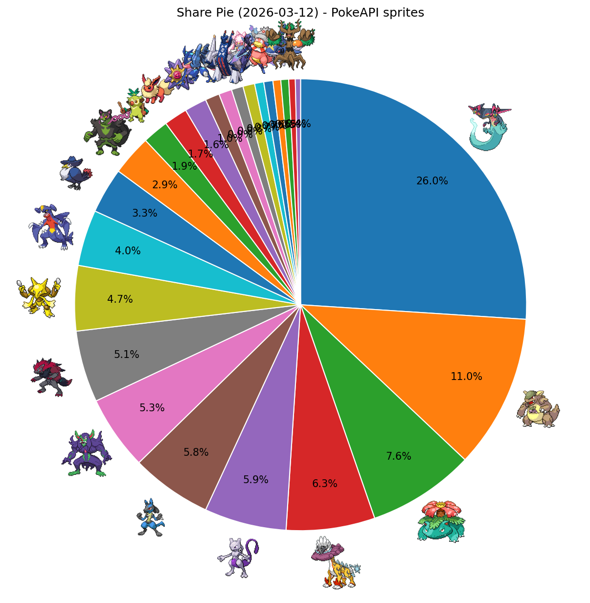
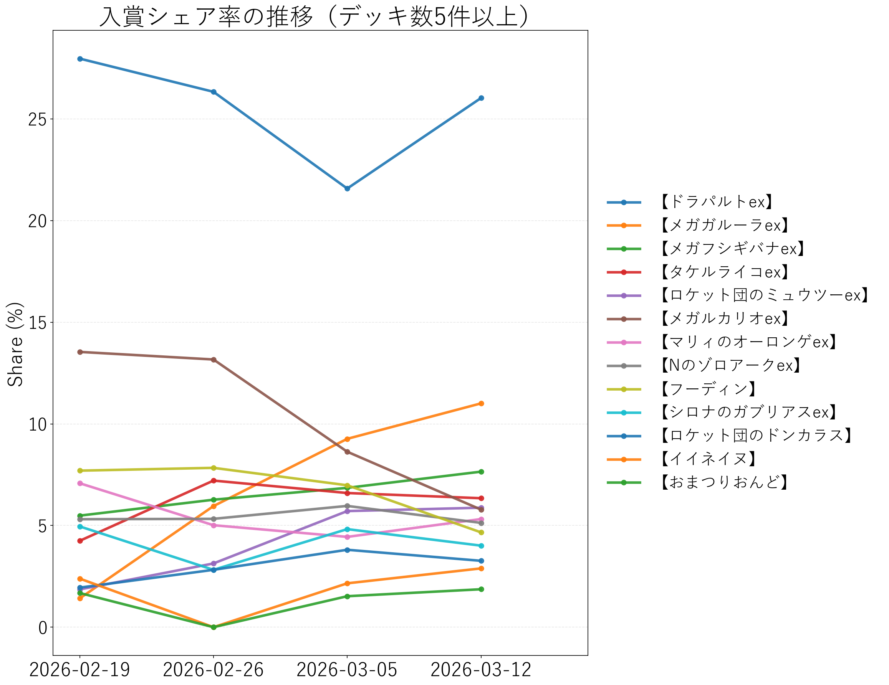

# シティリーグ週次レポート（2026-03-12更新）

## 1. 集計対象期間
- 今週分析期間（週次固定）: **2026-03-06 - 2026-03-12**
- 前週比較期間（週次固定）: **2026-02-27 - 2026-03-05**
- 今週入賞枠数: **1072** / 前週入賞枠数: **0**
- ランキング表示条件: **デッキ数 5件以上**

## 2. 入賞シェア（デッキ数5件以上）
- 参照: `output_csv/2026-03-12/season3_fixed_2026-03-12_period_distribution.csv`

|順位|デッキタイプ|入賞数|シェア|
|---:|---|---:|---:|
|1|【ドラパルトex】|279|26.03%|
|2|【メガガルーラex】|118|11.01%|
|3|【メガフシギバナex】|82|7.65%|
|4|【タケルライコex】|68|6.34%|
|5|【ロケット団のミュウツーex】|63|5.88%|
|6|【メガルカリオex】|62|5.78%|
|7|【マリィのオーロンゲex】|57|5.32%|
|8|【Nのゾロアークex】|55|5.13%|
|9|【フーディン】|50|4.66%|
|10|【シロナのガブリアスex】|43|4.01%|
|11|【ロケット団のドンカラス】|35|3.26%|
|12|【イイネイヌ】|31|2.89%|
|13|【おまつりおんど】|20|1.87%|
|14|【ブースターex】|18|1.68%|
|15|【メガスターミーex】|17|1.59%|
|16|【ゲッコウガex】|11|1.03%|
|17|【ダイゴのメタグロスex】|10|0.93%|
|18|【ブリジュラスex】|9|0.84%|
|19|【メガディアンシーex】|9|0.84%|
|20|【ソウブレイズex】|7|0.65%|
|21|【ヤドキング】|7|0.65%|
|22|【テラスタルバレット】|6|0.56%|
|23|【メガサメハダーex】|6|0.56%|
|24|【ホップのオーロット】|5|0.47%|

## 2.1 入賞シェア円グラフ（PokeAPI sprites）
- 画像: `output_csv/2026-03-12/season3_share_pie_pokeapi_2026-03-12.png`
- 対応表: `output_csv/2026-03-12/season3_share_pie_pokeapi_2026-03-12.csv`

## 2.2 入賞シェア率の推移
- 画像: `output_csv/2026-03-12/season3_share_trend_2026-03-12.png`
- 対応表: `output_csv/2026-03-12/season3_share_trend_2026-03-12.csv`

## 3. 前週比較（台頭 / 減少）
- 参照: `output_csv/2026-03-12/season3_fixed_2026-03-12_period_delta.csv`

### 3.1 台頭したデッキ（シェア増）
|デッキタイプ|前週シェア|今週シェア|差分|
|---|---:|---:|---:|
|【ドラパルトex】|21.57%|26.03%|+4.45pt|
|【メガガルーラex】|9.26%|11.01%|+1.74pt|
|【マリィのオーロンゲex】|4.44%|5.32%|+0.88pt|
|【メガフシギバナex】|6.85%|7.65%|+0.80pt|
|【イイネイヌ】|2.16%|2.89%|+0.73pt|
|【ブリジュラスex】|0.13%|0.84%|+0.71pt|
|【おまつりおんど】|1.52%|1.87%|+0.34pt|
|【ロケット団のミュウツーex】|5.71%|5.88%|+0.17pt|
|【ダイゴのメタグロスex】|0.89%|0.93%|+0.04pt|

### 3.2 減少したデッキ（シェア減）
|デッキタイプ|前週シェア|今週シェア|差分|
|---|---:|---:|---:|
|【メガルカリオex】|8.63%|5.78%|-2.85pt|
|【フーディン】|6.98%|4.66%|-2.32pt|
|【ゲッコウガex】|1.90%|1.03%|-0.88pt|
|【Nのゾロアークex】|5.96%|5.13%|-0.83pt|
|【シロナのガブリアスex】|4.82%|4.01%|-0.81pt|
|【ロケット団のドンカラス】|3.81%|3.26%|-0.54pt|
|【メガサメハダーex】|1.02%|0.56%|-0.46pt|
|【タケルライコex】|6.60%|6.34%|-0.26pt|
|【ソウブレイズex】|0.89%|0.65%|-0.24pt|
|【ブースターex】|1.90%|1.68%|-0.22pt|
|【テラスタルバレット】|0.76%|0.56%|-0.20pt|
|【ヤドキング】|0.76%|0.65%|-0.11pt|
|【メガスターミーex】|1.65%|1.59%|-0.06pt|
|【メガディアンシーex】|0.89%|0.84%|-0.05pt|
|【ホップのオーロット】|0.51%|0.47%|-0.04pt|

## 4. 安定スコアランキング（デッキ数5件以上）
- 参照: `output_csv/2026-03-12/season3_fixed_2026-03-12_decktype_stability_summary.csv`
- 指標: `stability_adoption_norm60_mean`

|順位|デッキタイプ|安定スコア|デッキ数|early_setup比率|
|---:|---|---:|---:|---:|
|1|【ドラパルトex】|0.2654|275|0.471|
|2|【メガスターミーex】|0.2387|17|0.499|
|3|【メガサメハダーex】|0.2266|6|0.514|
|4|【ゲッコウガex】|0.2246|11|0.415|
|5|【マリィのオーロンゲex】|0.2198|57|0.538|
|6|【Nのゾロアークex】|0.2176|55|0.454|
|7|【メガフシギバナex】|0.2013|75|0.514|
|8|【ヤドキング】|0.1977|7|0.393|
|9|【メガルカリオex】|0.1944|61|0.508|
|10|【テラスタルバレット】|0.1903|6|0.511|
|11|【おまつりおんど】|0.1778|20|0.468|
|12|【シロナのガブリアスex】|0.1765|43|0.440|
|13|【ブリジュラスex】|0.1722|9|0.454|
|14|【ブースターex】|0.1722|18|0.444|
|15|【メガディアンシーex】|0.1647|9|0.417|
|16|【ホップのオーロット】|0.1633|5|0.320|
|17|【ロケット団のミュウツーex】|0.1629|61|0.467|
|18|【ダイゴのメタグロスex】|0.1595|10|0.315|
|19|【イイネイヌ】|0.1569|31|0.439|
|20|【メガガルーラex】|0.1553|117|0.403|
|21|【タケルライコex】|0.1465|65|0.365|
|22|【ソウブレイズex】|0.1329|7|0.367|
|23|【フーディン】|0.1199|49|0.391|
|24|【ロケット団のドンカラス】|0.1092|34|0.522|

## 5. 来週以降のおすすめデッキランキング（ハイブリッド方式）
- 参照: `output_csv/2026-03-12/season3_hybridA_ps1_final_decktype_ranking.csv`
- matchup方式: `hybrid_top16`（Top16＋Top8推定）
- 掲載条件: デッキ数 5件以上

|順位|デッキタイプ|final_score|meta_share|high_finish_rate|
|---:|---|---:|---:|---:|

## 6. メタカード採用率（meta-forecast）
- 参照: `output_csv/2026-03-12/season3_meta_forecast_summary_2026-03-12.csv`
- 元ページ: https://pokeka-win-decks.jp/meta-forecast
- サイト更新時刻: `2026-03-12T12:56:02+09:00`
- 指標: 最新の非ゼロ週採用率（%）

|順位|メタカード|最新採用率|前週採用率|差分|集計週|
|---:|---|---:|---:|---:|---|
|1|マシマシラ(アドレナブレイン)|46.9%|40.5%|+6.4pt|2026年3月6日|
|2|スボミー(むずむずかふん)|44.2%|38.9%|+5.3pt|2026年3月6日|
|3|リーリエのピッピex(フェアリーゾーン)|35.8%|34.9%|+0.9pt|2026年3月6日|
|4|コダック(しめりけ)|26.5%|26.1%|+0.4pt|2026年3月6日|
|5|ロケット団の監視塔|21.9%|19.1%|+2.8pt|2026年3月6日|
|6|シェイミ(はなのカーテン)|17.6%|19.9%|-2.3pt|2026年3月6日|
|7|ジャミングタワー|12.2%|14.7%|-2.5pt|2026年3月6日|
|8|バトルコロシアム|11.8%|14.6%|-2.8pt|2026年3月6日|
|9|ミストエネルギー|10.0%|8.8%|+1.2pt|2026年3月6日|
|10|ロケット団のミミッキュ(ほうせきごっこ)|6.3%|5.7%|+0.6pt|2026年3月6日|
